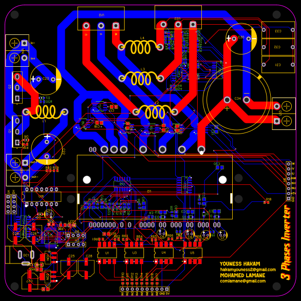
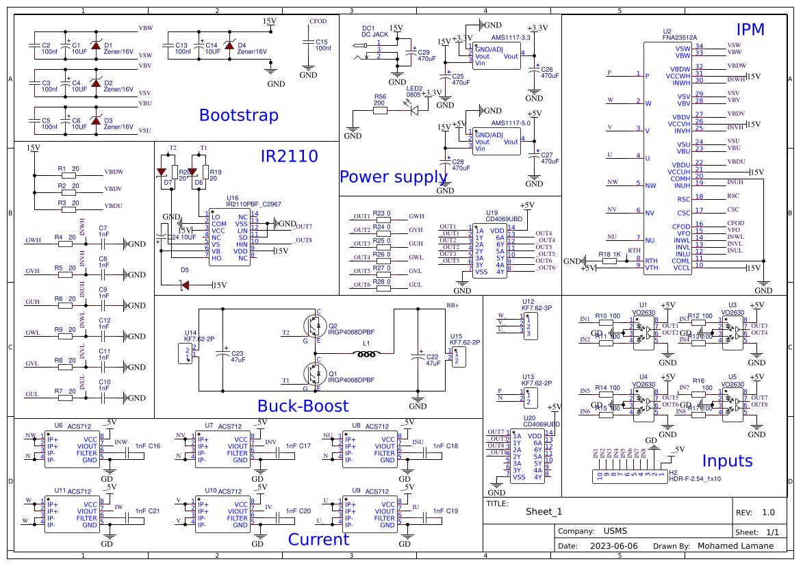

# Three-Phase Motor Controller

## Overview
This project implements a three-phase motor controller designed for open-loop and closed-loop operation. The hardware is based on the FNA23512A Intelligent Power Module (IPM), enabling safe and efficient control of AC motors. It includes full documentation, schematics, and layout files, created using EasyEDA Std.

## Features
- **Power Stage**: 1200V / 35A IGBT inverter (FNA23512A)
- **Integrated Protections**: UVLO, over-current shutdown, fault signaling
- **Inputs**: 6 PWM (3 high-side, 3 low-side), 5V/3.3V compatible
- **Feedback Support**: Thermistor, current sensing (NU/NV/NW terminals)
- **Dual Mode**:
  - **Open-loop**: V/Hz, 6-step commutation
  - **Closed-loop**: PID, FOC (with sensors)
- **Power Supply**: DC bus up to 600V, 15V logic supply
- **Cooling**: Heatsink mountable, integrated thermistor

## Assembly
1. Solder small SMD and passive components.
2. Mount and solder the FNA23512A module.
3. Attach DC bus capacitors, power and signal connectors.
4. Install heatsink with thermal interface material.
5. Verify all wiring and inspect for solder bridges.

## Wiring
- **Motor**: Connect U/V/W outputs.
- **Power**: DC P/N terminals (or AC via rectifier).
- **Control**: Connect 6 PWM signals, Fault, optional sensor inputs.
- **15V Supply**: Required for IPM operation.

## Operation Modes
- **Open-loop**: Basic operation without sensors, use fixed PWM or V/Hz.
- **Closed-loop**: Use sensor feedback for speed/torque control via MCU.
- Monitor fault line (VFO), protect against overcurrent and overheating.

## Safety
- High voltage: Use isolation and grounding precautions.
- Ensure thermal management with heatsink.
- Never bypass protections; use current-limited sources during testing.

## Repository Contents
- `Schematic_hkm_igbt_module_2025-05-30.pdf`: Full schematic
- `FNA23512A-D.pdf`: Module datasheet
- `07c46b8e3738426e85f0332e4b6f73aa.png`: PCB layout images
- `README.md`: This file

Designed with EasyEDA Std for motor control experimentation and integration in lab/industrial environments.
